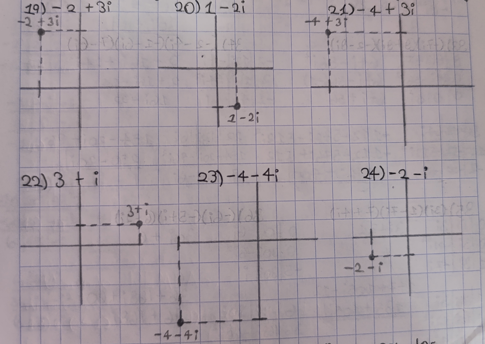

**Ubica los siguientes números complejos en el plano.**  
**19) -2+3i &nbsp; &nbsp; &nbsp; &nbsp; &nbsp; &nbsp; 20) 1-2i &nbsp; &nbsp; &nbsp; &nbsp; &nbsp; &nbsp; 21) -4+3i &nbsp; &nbsp; &nbsp; &nbsp; &nbsp; &nbsp; 22) 3+i &nbsp; &nbsp; &nbsp; &nbsp; &nbsp; &nbsp; 23) -4-4i &nbsp; &nbsp; &nbsp; &nbsp; &nbsp; &nbsp; 24) -2-i**
  
<p></p>
<p></p>

**Resuelve las siguientes operaciones con los números complejos.**  
``````
25) (-7-4i)-(2+i)          26) (2-4i)-(5-3i)          27) (7-8i)-(3i)-7
-7-2 | -4i-i               2-5 | -4i+3i               7-7 | -8-3i
-9-5i                      -3-i                       -11i

28) (1+5i)+(-8-5i)+3       29) -8-(3-5i)+(4+8i)       30) (-4+2i)+(3i)+(-4-7i)
1-8+3 | 5i-5i              -8-3+4 | 5i+8i             -4-4 | 2i+3i-7i
-4                         -7+13i                     -2i

31) (2i)(-4i)              32) (-2i)(5i)6                                33) (-7i)(8+8i)(-2-8i)
-8i² = -8(-1)              6 |30i|-2i     30i-10i²                       8 |64i|-7i      64i-56i²
8                          0 |30i|-10i²   30i+10                         0 |64i|-56i²    64i-56(-1)
                           0 | 0 | 5i                                    0 | 0 |8i       64i+56

                                                                         56|-448i| 64i      -112-576i-512i²
                                                                       -112|-576i|-512i²    -112-576i+512
                                                                         -2|-128i| -8i      -576i+400


34) (-2-4i)(-1-6i)(7-6i)                35)(3i)(1-7i)(7+4i)              36) (-6i)(-5+i)(6-2i)
-2|12i|-4i       2+16i+24i²               0| 0 |3i                        0 | 0 |-6i
 2|16i|24i²      2+16i-24                 0| 3i|-21i²    3i+21            0 |30i|-6i²       30i+6
-1|4i |-6i       16i-22                   1| 3i|-7i                       -5|30i| i 

22 |-132i|16i     154-20i+96             21|84i |3i      147+105i-12      6 |-12i|30i      36+168i+60
154|-20i |-96i²   250-20i               147|105i|12i²    135+105i         36|168i|-60i²    96+168i
7  | 112i|-6i                             7|21i |4i                       6 |180i|-2i


37) 10-7i/1+3i                            38) 4+2i/-1-10i                 39) 1+4i/-1-6i
10|-30i|-7i    10-37i-21                  4|40i|2i        -4+38i-20       1 |6i |4i      -1+2i-24
10|-37i|21i²   -11-37i                   -4|38i|20i²      -24+38i         -1|2i |24i²    -25+2i
1 |-7i |-3i                              -1|-2i|10i                       -1|-4i|6i
                
1 |-3i|3i     1+9 = 10                  -1|-10i|-10i     1+100 = 101      -1|-6i|-6i      1+36 = 37
1 | 0 |-9i²   -11-37i/10 = -3.7i-1.1     1| 0  |-100i²   -24+38i/101       1| 0 |-36i²    -25+2i/37
1 | 3i|-3i                              -1|10i |10i                       -1|6i |6i


40) -8+4i/1+i                           41) -10+8i/6+i                    42) 2-2i/4-10i
-8|8i |4i     -8+12i+4                  -10|10i|8i      -60+58i+8         2|20i|-2i       8+12i+20
-8|12i|-4i²   -4+12i                    -60|58i|-8i²    -52+58i           8|12i|-20i²     28+12i
 1| 4i|-i                                6 |48i|-i                        4|-8i|10i
  
1 |-i | i     1+1 = 2                   6 |-6i| i       36+1 = 37         4| 40i|-10i     16+100 = 116
1 | 0 |-i²    -4+12i/2 = -2+6i          36| 0 |-i²      -52+58i/37       16|  0 |-100i²   28+12i/116
1 | i |-i                                6|6i |-i                         4|-40i| 10i

``````
**Calcula el valor absoluto de los siguientes números complejos.**  
``````
43) |-9-9i|         44) |8-6i|          45) |6-3i|
z = 9²+9²           z = 8²+6²           z = 6²+3²
z = 162             z = 100             z = 45
z = 12.727          z = 10              z = 6.708

46) |10+10i|        47) |6-10i|         48) |-1+7i|
z = 10²+10²         z = 6²+10²          z = 1²+7²
z = 200             z = 136             z = 50
z = 14.142          z = 11.661          z = 7.071
``````
**Resuelve las siguientes potencias de i.**

