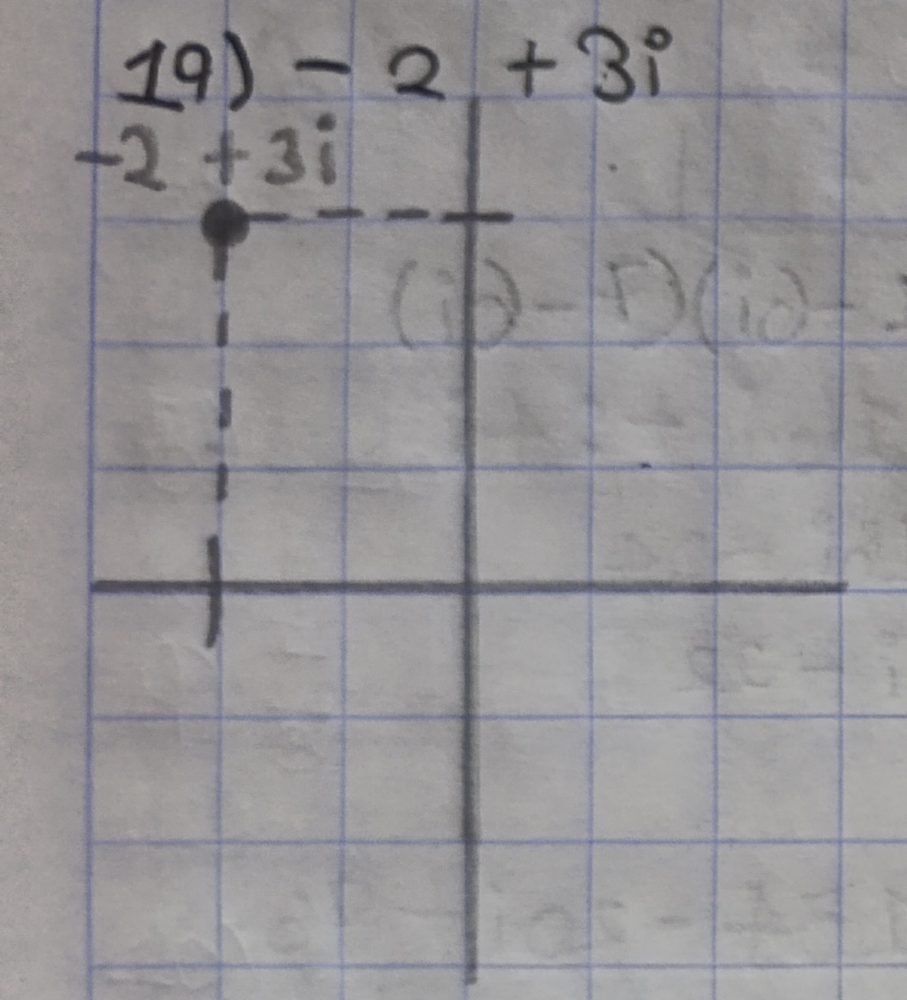

**Ubica los siguientes números complejos en el plano. **  
**19) -2+3i &nbsp; &nbsp; &nbsp; &nbsp; 20) 1-2i &nbsp; &nbsp; &nbsp; &nbsp; 21) -4+3i &nbsp; &nbsp; &nbsp; &nbsp; 22) 3+i &nbsp; &nbsp; &nbsp; &nbsp; 23) -4-4i &nbsp; &nbsp; &nbsp; &nbsp; 24) -2-i**

